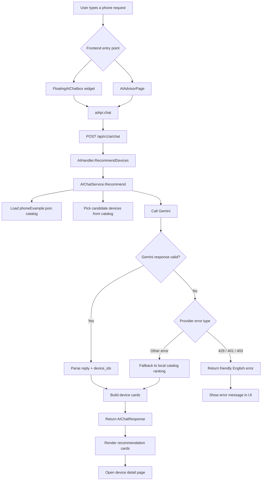

# AI Chatbox Flow

This document shows the end-to-end flow of the AI chatbox used by the floating widget and the dedicated `/ai-advisor` page.

## Flow diagram

## Response contract

The AI endpoint returns:

- `reply`: short English explanation
- `devices`: array of `RecommendedDeviceCard`

Each card contains:

- `id`
- `brand_name`
- `model_name`
- `imageUrl`
- `detail_url`
- optional specs such as `os`, `chipset`, `memory`, `battery`, `price`

## Notes

- The catalog is grounded in `phoneExample.json`.
- The service normalizes catalog image paths so MinIO-hosted images can be rendered in the frontend.
- If Gemini is unavailable, the backend can still return a local fallback based on the catalog.
- The frontend widget and the full page both render the same recommendation card shape.

## Related files

- `fe/src/components/ai/FloatingAIChatbox.tsx`
- `fe/src/pages/AIAdvisorPage.tsx`
- `fe/src/api/ai.ts`
- `fe/src/types/index.ts`
- `internal/delivery/handler/ai_handler.go`
- `internal/service/ai_chat_service.go`

