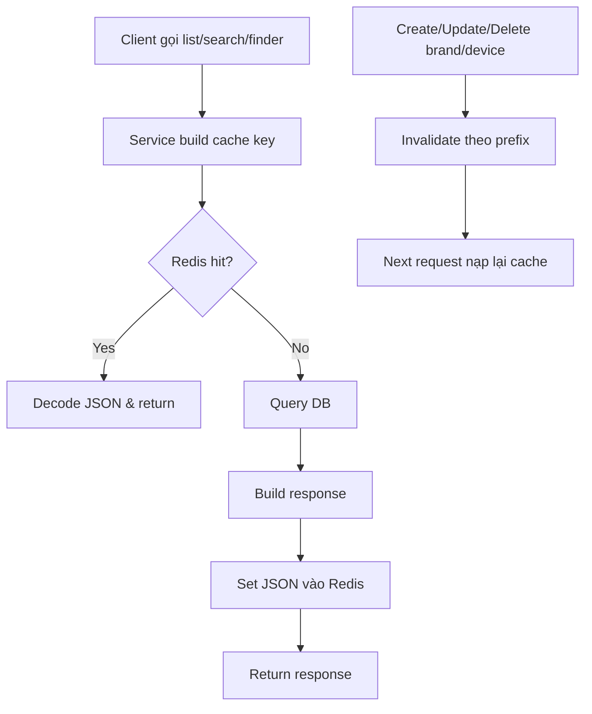

# Redis Cache Strategy

TZone hiện đang dùng **Redis cache theo kiểu cache-aside / read-through cho các trang list và finder**.

## 1) Tóm tắt ngắn

- **Đọc trước từ cache** cho các API list/search/finder.
- Nếu **cache hit** thì trả thẳng dữ liệu từ Redis.
- Nếu **cache miss** thì truy vấn database, rồi **ghi JSON response vào Redis**.
- Khi dữ liệu thay đổi, hệ thống sẽ **invalidate cache theo prefix**.
- Redis là **best-effort**: nếu Redis lỗi hoặc không cấu hình, request vẫn chạy bình thường và quay về DB.

## 2) Những gì đang được cache

Các response sau được cache dạng JSON:

| Nhóm API | Ví dụ |
|---|---|
| Brand list | `GET /api/v1/brands` |
| Brand search | `GET /api/v1/brands/search?name=...` |
| Device list | `GET /api/v1/devices` |
| Device by brand | `GET /api/v1/devices/brand/:brandId` |
| Device search | `GET /api/v1/devices/search?name=...` |
| Device finder | `GET /api/v1/devices/finder?...` |

Hiện tại cache đang tập trung vào **danh sách / tìm kiếm / lọc** vì đây là các endpoint có tần suất gọi cao nhất.

## 3) Cache pattern đang dùng

### Read path

1. Service build cache key.
2. Gọi `GetJSON(...)` từ Redis.
3. Nếu có dữ liệu:
   - parse JSON
   - trả response ngay.
4. Nếu không có dữ liệu hoặc Redis lỗi:
   - query DB
   - build response
   - `SetJSON(...)` vào Redis
   - trả response.

### Write path

Sau khi tạo / cập nhật / xóa dữ liệu brand hoặc device:

1. Service thực hiện mutation xuống DB.
2. Gọi `DeleteByPrefixes(...)`.
3. Xóa các key liên quan tới list/search/finder.
4. Lần gọi tiếp theo sẽ đọc lại từ DB và nạp cache mới.

## 4) Key strategy

Các key được đặt theo prefix để dễ invalidation:

- `brands:list:`
- `brands:search:`
- `devices:list:`
- `devices:brand:`
- `devices:search:`
- `devices:finder:`

Ví dụ:

- `brands:list:p=1:l=8`
- `devices:search:name=iphone:p=1:l=10`
- `devices:finder:name=...:brand=...:os=...:p=1:l=10`

> Finder key có đầy đủ các filter đang được truyền lên để tránh trộn response giữa các bộ lọc khác nhau.

## 5) TTL hiện tại

- TTL cache hiện tại đang được wire ở tầng khởi tạo server là **3 phút**.
- `CacheService` có fallback mặc định là **2 phút** nếu TTL truyền vào không hợp lệ.

Điều này có nghĩa:

- **Cấu hình hiện tại của app:** 3 phút
- **Fallback nội bộ:** 2 phút

## 6) Invalidation strategy

Hiện tại project dùng **prefix-based invalidation**:

- Khi brand thay đổi:
  - xóa toàn bộ key có prefix `brands:list:` và `brands:search:`
- Khi device thay đổi:
  - xóa toàn bộ key có prefix:
    - `devices:list:`
    - `devices:brand:`
    - `devices:search:`
    - `devices:finder:`

Cách này đơn giản, dễ hiểu, và phù hợp với dữ liệu list/finder vốn thay đổi theo nội dung catalog.

## 7) Fallback behavior

Redis được xem là **không bắt buộc**.

Nếu:
- `REDIS_URL` không được set, hoặc
- Redis không khởi động được, hoặc
- Redis timeout / cache read-write lỗi,

thì ứng dụng vẫn:
- truy vấn DB bình thường,
- trả response cho client,
- chỉ là không dùng cache.

Nói cách khác: cache là **tối ưu hiệu năng**, không phải dependency bắt buộc.

## 8) Docker / env

### Environment

Biến môi trường liên quan:

```env
REDIS_URL=redis://localhost:6379/0
```

### Docker Compose

Docker stack có service Redis riêng và API sẽ dùng:

- `REDIS_URL: redis://redis:6379/0`

Trong `docker-compose.yml`, API cũng phụ thuộc Redis healthcheck để tránh khởi động trước khi Redis sẵn sàng.

## 9) Flow minh họa



## 10) Lợi ích của strategy hiện tại

- Giảm số lần query DB cho các endpoint list/finder.
- Dễ debug vì key có prefix rõ ràng.
- Invalidation đơn giản, không cần tracking phức tạp.
- Nếu Redis lỗi, app vẫn hoạt động.

## 11) Hạn chế / điểm cần lưu ý

- Prefix invalidation sẽ scan và xóa nhiều key khi catalog lớn.
- Cache response JSON phù hợp cho list/finder, nhưng chưa tối ưu cho query cực lớn hoặc lọc quá nhiều biến thể.
- Chưa có cơ chế warming cache hay cache metrics.

## 12) Kết luận

Strategy hiện tại của TZone là:

**Cache-aside / read-through cho list & finder + prefix-based invalidation khi write**

Đây là lựa chọn cân bằng giữa:
- dễ triển khai,
- dễ bảo trì,
- đủ hiệu quả cho catalog smartphone,
- và an toàn khi Redis gặp sự cố.

